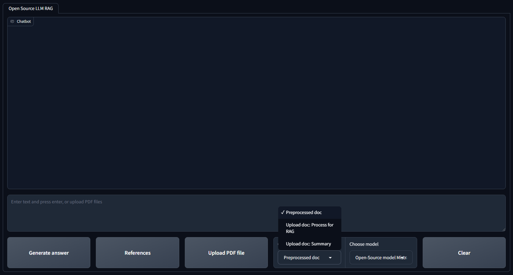
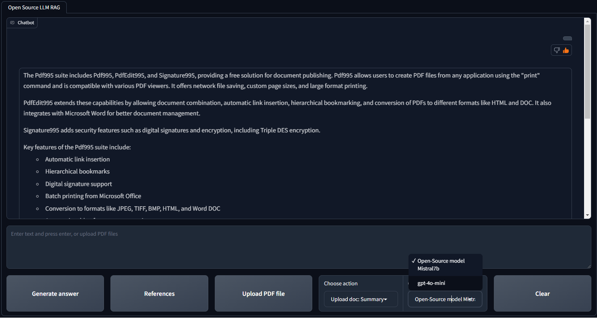

# Open-Source LLM RAG and Summarization with FastAPI

Welcome to the Open Source LLM RAG Model project! This project utilizes Google Colab to initialize and load the model, as well as to create a FastAPI endpoint. Open Source LLM Mistral 7b can answer questions and summarize content based on local and uploaded PDF files. It supports interactive document processing through a user-friendly Gradio interface, providing functionalities such as question answering and summarization. The project utilizes the Mistral 7B model and allows users to compare performance with GPT-4o-mini.




## Features

- **Question Answering**: Ask questions based on the content of local PDF files and receive accurate answers.
- **PDF Upload**: Load PDF files directly through the Gradio interface for on-the-fly processing.
- **Summarization**: Generate concise summaries of the uploaded PDF files.
- **Model Comparison**: Compare the performance of the Mistral 7B model with GPT-4o-mini.
- **References**: View references returned with the answers for transparency and verification.

## Installation

1. Clone the repository

2. Install the required dependencies:

    ```sh
     pip install langchain-community
     pip install langchain-chroma
     pip install gradio
     pip install pyprojroot
     pip install sentence-transformers
     pip install pypdf
     pip install chromadb
     pip install openai
     pip install dotenv
    ```

## Usage

1. Run the FastAPI_LLM notebook in Google Collab. It will load models and will create a FastAPI endpoint

1. Run the gradio_ui.py file

2. Open your web browser and go to `http://localhost:7860` to access the Gradio interface.

3. Use the interface to:
    - Upload PDF files.
    - Ask questions about the content of the PDFs.
    - Get summaries of the uploaded PDFs.
    - Compare the performance of different models.
    - View references for the answers provided.

## Interface Overview

The user interface includes several interactive elements to facilitate document processing and model selection:

### Buttons

- **Generate Answer**: Click this button to generate answers based on the content of the uploaded PDF file.
- **References**: Click this button to view the references related to the answer provided, ensuring transparency and source verification.
- **Upload PDF File**: Use this button to upload your local PDF files for processing.

### Drop-Down Lists

- **Choose Action**:
  - **Processed doc**: View the document that has already been processed.
  - **Upload doc: Process for RAG**: Upload a PDF file and process it for question answering using Retrieval-Augmented Generation (RAG).
  - **Upload doc: Summary**: Upload a PDF file and generate a summary of its content.

- **Choose Model**:
  - **Mistral7b**: Select this model for processing the PDF file.
  - **gpt-4o-mini**: Select this model for a performance comparison with Mistral7b.
    
---

Thank you for using the Open Source LLM RAG Model!
